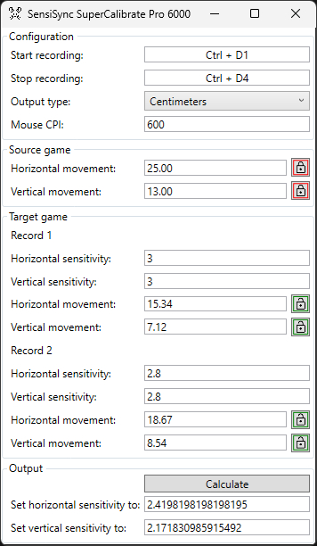

# 🌟 Introducing the sensational <b><i>SensiSync SuperCalibrate Pro 6000</i></b> - Seamless Sensitivity Synchronization Solution!🐍 🌟

Are you tired of fumbling around with your sensitivity settings every time you dive into a new game? Do you yearn for pixel-perfect precision without the headache of endless adjustments? Well, hold onto your mouses, because your ultimate solution has arrived.

🌟 Introducing the <b><i>SensiSync SuperCalibrate Pro 6000</i></b> - Seamless Sensitivity Synchronization Solution!🐍 🌟

Say bye-bye 👋 to frustration and hi-five ✋ to precision with <b><i>SensiSync SuperCalibrate Pro 6000</i></b>! Get ready for a rollercoaster ride 🎢 of pixel-perfection! Unlock a whole new dimension of gaming nirvana 🧘🏼‍♂️.

Dance 💃 through games with the elegance of a 🕺 ballerino! FPS, MOBA, Battle Royale - we've got 'em all covered. It's a symphonic orchestra 🎻 of settings, perfectly synchronized for your gaming symphony.

Level up your gaming 🎮 like never before! Transform your aim 🎯 from drab to fab with <b><i>SensiSync SuperCalibrate Pro 6000</i></b>, all thanks to cutting-edge 🔪 calibration wizardry. Abracadabra 🪄 - no more sensitivity sorrows!

⚡️ Zap! Your aim is now sharper than a sword ⚔️! <b><i>SensiSync SuperCalibrate Pro 6000</i></b> brilliance will make you feel like a wizard 🧙🏼‍♂️ in the gaming realm. Take that, pesky opponents!

Time travel ⏱️? Nah, just <b><i>SensiSync SuperCalibrate Pro 6000</i></b> lightning-speed calibration ⚡. Quick as a flash 🔦, you'll be armed and ready for virtual battle. No more delays, only swift victory dances 💃🕺!

Lock 'em up 🔒! <b><i>SensiSync SuperCalibrate Pro 6000</i></b> guards your settings like a 🦁 lion protects its den. Top-notch security so you can rest easy 😴, knowing your settings are safe. We basically don't store them!

Blast off 🚀 into the future of gaming! <b><i>SensiSync SuperCalibrate Pro 6000</i></b> isn't just an app, it's a warp drive 🛸 to gaming greatness. Your rocket ship to the stars 🌌 of precision and power! One small step for you, one giant leap 🚀 for gaming kind! Embrace <b><i>SensiSync SuperCalibrate Pro 6000</i></b> and conquer 🫅🏼 the gaming universe.

💥 Kaboom! Break free from sensitivity shackles. 🔥 Ignite the <b><i>SensiSync SuperCalibrate Pro 6000</i></b> sensation now! Join the revolution and wave 🎉 goodbye to sensitivity struggles forever. <b><i>SensiSync SuperCalibrate Pro 6000</i></b> speak louder than words. <b><i>SensiSync SuperCalibrate Pro 6000</i></b> speaks the language of champions! 🏆🔥

Unleash Your Gaming Greatness! Behold <b><i>SensiSync SuperCalibrate Pro 6000</i></b>

## How to run
1. Download the latest release from [here](https://github.com/piotr-wawro/mouse-sensitivity-calibrator/releases)
2. Unzip the archive
3. Run MouseSensitivityCalibrator.exe

## How to use

#### Example
1. Set mouse movement in the source game
    * Run the game which has your desired sensitivity set
    * Start recording
    * Do a 360
    * Stop recording
    * Lock horizontal movement in the "Source game" section
    * Optionally repeat the steps for vertical movement
2. Set mouse movement in record 1 of target game (same steps as above)

   You probably didn't make it the first try, soo...

3. Change your sensitivity and repeat for record 2.

   Now you don't have to try third time, because you can calculate sensitivity

4. Click calculate

#### Things to note:
1. You can set data manually by clicking on the box and typing in values.
2. Remember to lock boxes when you're done with recording.
2. While calculating sensitivity assumption is made that it scales linearly.

## Configuration
#### Start and stop recording
You can set your own hotkeys for start and stop recording. Click with LMB on box to focus and press up to four modifier keys (ctrl, shift, alt, win) plus one standard key. To remove hotkey press backspace or delete. To lose focus press escape.

#### Output type
If your mouse has 600 CPI (counts per inch) and you move it 1 inch, you will get 600 counts. Select conversion to translate CPI to cm or inches. 

#### Mouse CPI
Setting your mouse CPI is optional, as it isn't factored into calculations. It is used when converting counts to cm or inches.
